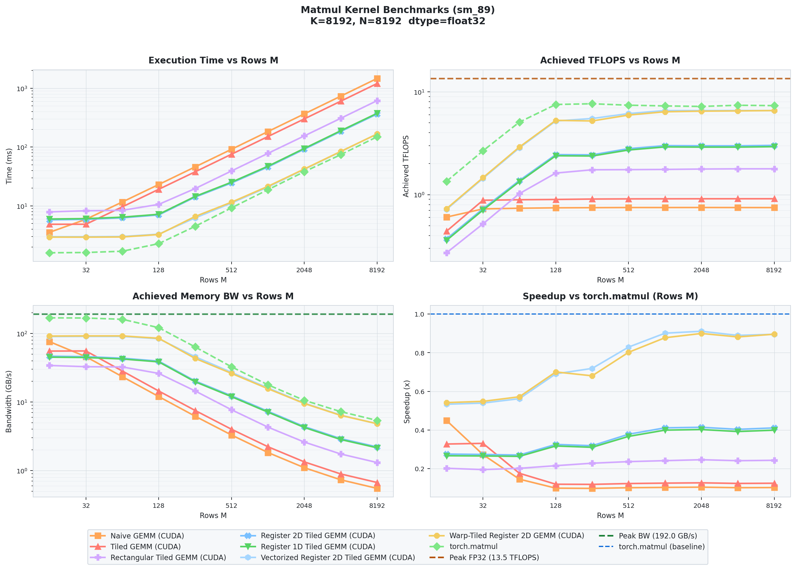

# CUDA-GEMM

 A CUDA/C++ and PyTorch extension playground for exploring fundamentals of GEMM kernel optimization. It provides custom CUDA matrix multiplication kernels, parity tests against `torch.matmul`, a reproducible benchmark with bar-plots, line-graphs, and latency records in JSON format, and Nsight profiling entrypoints.



Current benchmarked kernels:

- `naive_matmul`
- `tiled_matmul`
- `coarsened_tiled_matmul`
- `reg1d_tiled_matmul`
- `reg2d_tiled_matmul`
- `vec_reg2d_tiled_matmul`
- `warp_tiled_matmul`
- `torch_matmul`

## Requirements

- NVIDIA GPU
- CUDA toolkit with `nvcc`
- Python 3.8 or newer
- PyTorch with CUDA support
- CMake 3.18 or newer
- Optional: Nsight Compute `ncu` and Nsight Systems `nsys`

The build targets the local GPU architecture detected through `nvidia-smi`.

## Setup

```bash
python -m venv .venv
source .venv/bin/activate
python -m pip install --upgrade pip
python -m pip install -e .
```

Build the CUDA extension:

```bash
./scripts/build.sh
```

The extension is written to:

```text
src/cuda_gemm/backends/cuda/cuda_gemm_cuda.so
```

Quick loader check:

```bash
python - <<'PY'
import torch
from cuda_gemm.backends.cuda.loader import sgemm

a = torch.randn(64, 128, device="cuda")
b = torch.randn(128, 256, device="cuda")
out = sgemm(a, b)
torch.testing.assert_close(out, torch.matmul(a, b), atol=1e-4, rtol=1e-3)
print(out.shape)
PY
```

## Validation

Run parity tests:

```bash
pytest tests/parity/test_cuda_gemm_matmul.py
```

Run benchmark infrastructure tests:

```bash
pytest tests/benchmarks
```

Run the full test suite:

```bash
pytest
```

CUDA tests are marked with `requires_cuda` and skip when CUDA is unavailable.

## Reproducing Benchmarks

Run the default GEMM benchmark:

```bash
python benchmarks/kernels/primitives/matmul.py
```

Run a smaller reproducible sweep:

```bash
python benchmarks/kernels/primitives/matmul.py \
  --kernels naive_matmul tiled_matmul torch_matmul \
  --M 16 32 64 128 \
  --K 1024 \
  --N 1024 \
  --dtype float32 \
  --warmup-ms 5 \
  --timed-ms 20 \
  --report-style both
```

Benchmark outputs are written to:

```text
benchmarks/reports/timing/matmul/<run_id>/
benchmarks/reports/plots/matmul/<run_id>/
```

Each run writes JSON timing records, final-dimension TXT summaries, and PNG plots.

Useful benchmark flags:

- `--kernels`: kernels to compare
- `--M`: row-dimension sweep values
- `--K`, `--N`: fixed GEMM dimensions
- `--dtype`: `float32`, `float16`, or `bfloat16`
- `--compare-metrics`: `latency`, `tflops`, `bandwidth`
- `--cuda-graph`: enable CUDA graph timing
- `--no-l2-flush`: disable cold L2 cache flushing
- `--out-dir`: custom report directory

## Profiling

Nsight Compute:

```bash
benchmarks/profiling/ncu/run.sh \
  --kernel tiled_matmul \
  --M 512 \
  --K 2048 \
  --N 2048 \
  --dtype float32
```

Dry run:

```bash
benchmarks/profiling/ncu/run.sh --kernel tiled_matmul --dry-run
```

Nsight Systems:

```bash
benchmarks/profiling/nsys/run.sh \
  --kernel tiled_matmul \
  --M 512 \
  --K 2048 \
  --N 2048 \
  --warmup-iters 2 \
  --iters 5
```

Profiler outputs are written to:

```text
benchmarks/reports/ncu/
benchmarks/reports/nsys/
```

## Adding a Kernel

1. Add the CUDA implementation under `csrc/primitives/matmul/kernels/`.
2. Wire dispatch and bindings through the existing matmul C++/CUDA extension path.
3. Add a Python loader function in `src/cuda_gemm/backends/cuda/loader.py`.
4. Rebuild with `./scripts/build.sh`.
5. Add parity coverage in `tests/parity/test_cuda_gemm_matmul.py`.
6. Register one `KernelSpec` in `benchmarks/harness/baselines.py`.
7. Add a profiler regex in `benchmarks/profiling/common.py` if the kernel should be profiled through `ncu/run.sh`.

Minimal benchmark registration:

```python
KernelSpec(
    name="my_kernel_matmul",
    callable=my_kernel_loader_function,
    label="My Kernel GEMM (CUDA)",
    line_color="#58a6ff",
    bar_color="#4DB6AC",
    marker="o",
    aliases=("optional_legacy_name",),
)
```

Verify the integration:

```bash
pytest tests/parity/test_cuda_gemm_matmul.py
pytest tests/benchmarks
python benchmarks/kernels/primitives/matmul.py \
  --kernels my_kernel_matmul torch_matmul \
  --M 64 128 \
  --K 1024 \
  --N 1024 \
  --warmup-ms 5 \
  --timed-ms 20
```
